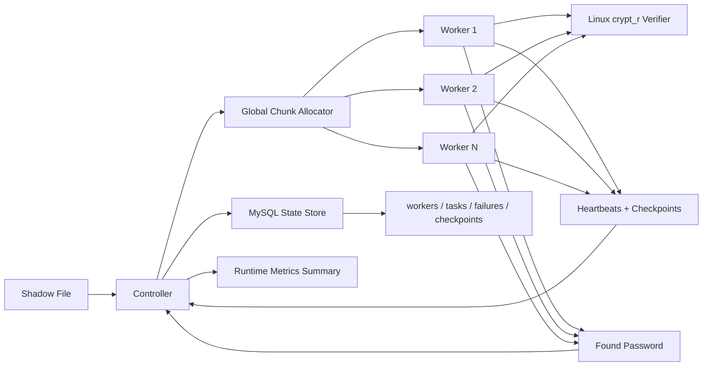
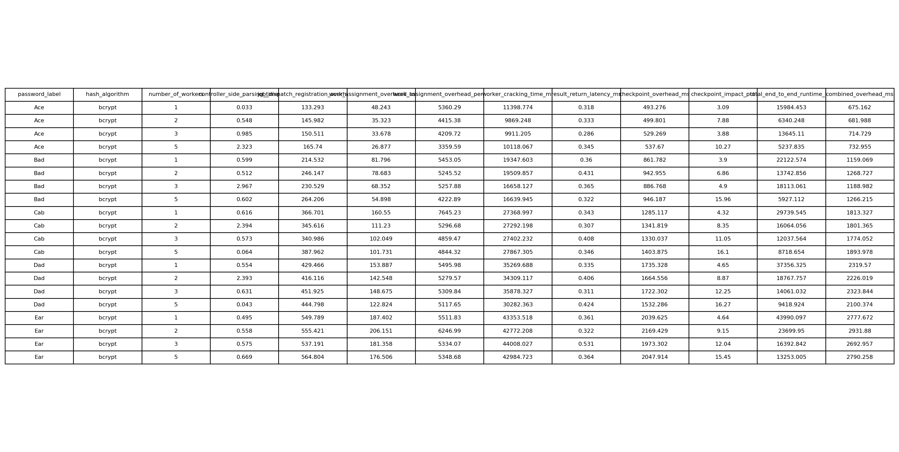
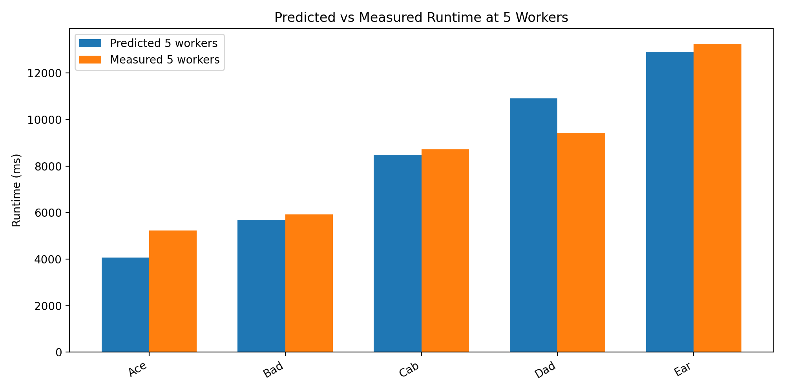
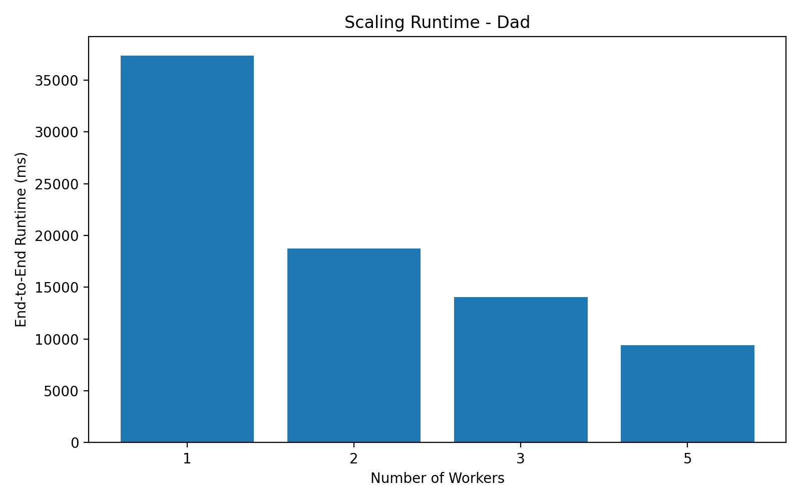
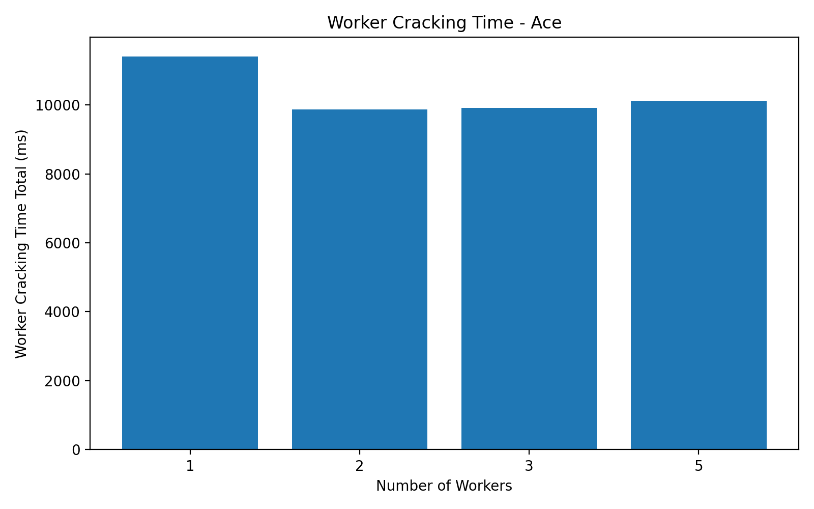
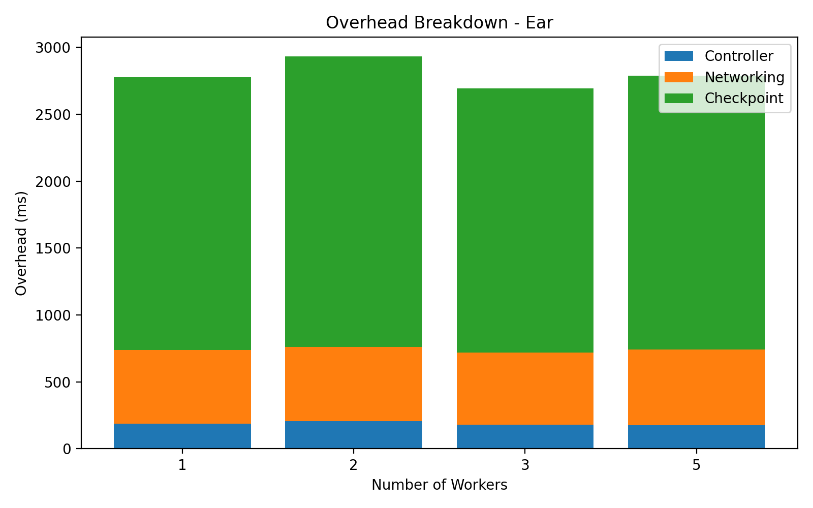
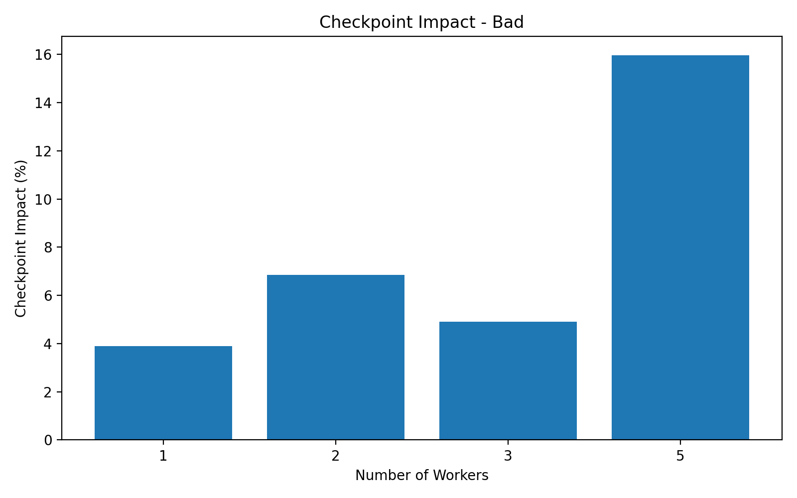
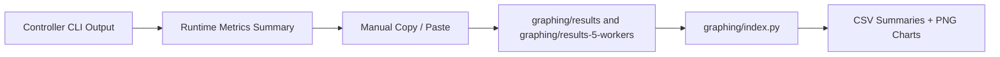

# Unix Password Cracker


Distributed controller/worker system for cracking Unix shadow hashes by partitioning the password space across multiple workers, tracking progress with checkpoints, and persisting worker/task state for failure handling.

This project is best understood as a distributed systems and infrastructure exercise, not just a brute-force tool. The interesting parts are chunk allocation, worker coordination, liveness checks, checkpoint-based recovery, persistence, and performance analysis.

> Authorized security research, coursework, and lab use only.

## Why This Project Matters

- Treats password cracking as a coordination problem instead of a single-process script.
- Splits the search space across multiple workers and multiple goroutines per worker.
- Detects failures with heartbeats and resumes interrupted work from the latest checkpoint.
- Persists workers, tasks, failures, and checkpoints in MySQL.
- Captures runtime measurements and turns benchmark logs into CSVs and diagrams.

## Architecture



## Core Features

- TCP-based controller/worker protocol with explicit job, heartbeat, checkpoint, error, and stop messages
- Global chunk allocation on the controller and per-job sub-allocation inside each worker
- Multi-threaded worker execution over candidate password ranges
- Shadow-file parsing for a specific Unix user entry
- Linux `crypt_r` hash verification for real shadow-hash matching
- Worker heartbeat monitoring and timeout-triggered chunk requeue
- Checkpoint reporting and checkpoint-based resume on worker failure
- MySQL-backed persistence for worker state, task assignment/completion, failures, and checkpoints
- Runtime metric collection for parsing, dispatch, compute, checkpoint, networking, and total runtime

## Quick Start

### 1. Start the environment

```bash
docker compose up --build -d mysql ubuntu
docker compose exec ubuntu bash
```

The container already includes `golang`, `tmux`, `git`, and `curl`.

### 2. Move into the Go module

```bash
cd /app/distributed-muilti-workers
```

Note: the Go module lives under `distributed-muilti-workers/`.

### 3. Start the controller

```bash
go run ./cmd/controller \
  -p 8080 \
  -f testdata/shadow/shadow_ACE_bcrypt \
  -u ACE \
  -b 1 \
  -c 1000 \
  -k 100 \
  --reset
```

### 4. Start workers in separate shells or tmux panes

```bash
go run ./cmd/worker -c 127.0.0.1 -p 8080 -t 4
```

Launch 3-5 workers to see the distributed behavior and compare runtimes.

## CLI Reference

### Controller

```bash
go run ./cmd/controller -p PORT -f SHADOW_FILE -u USERNAME -b HEARTBEAT_SECONDS -c PARTITION_SIZE -k CHECKPOINT_INTERVAL [-d MYSQL_DSN] [--reset]
```

- `-p`: controller port
- `-f`: shadow file path
- `-u`: target username
- `-b`: heartbeat interval in seconds
- `-c` or `-s`: partition size for the password space
- `-k`: checkpoint interval measured in candidate attempts
- `-d`: MySQL DSN
- `--reset`: drops and recreates tracking tables before startup

### Worker

```bash
go run ./cmd/worker -c HOST -p PORT -t THREADS
```

- `-c`: controller host
- `-p`: controller port
- `-t`: number of worker threads

## Execution Flow

1. The controller parses a target user from a shadow file.
2. Workers connect over TCP and request work.
3. The controller assigns a global chunk from the password space.
4. Each worker splits its assigned chunk into smaller work items across goroutines.
5. Workers send heartbeat and checkpoint reports while searching.
6. If a worker fails or times out, the controller requeues the chunk from the latest checkpoint.
7. When a worker finds the password, the controller persists the result and broadcasts `stop` to all workers.

## Benchmark Snapshot

The repo already contains benchmark summaries and generated plots under `graphing/`.

| Password | 1 Worker | 5 Workers | Speedup |
| --- | ---: | ---: | ---: |
| Ace | 15.98s | 5.24s | 3.05x |
| Bad | 22.12s | 5.93s | 3.73x |
| Cab | 29.74s | 8.72s | 3.41x |
| Dad | 37.36s | 9.42s | 3.97x |
| Ear | 43.99s | 13.25s | 3.32x |

- Observed 1-to-5 worker speedup ranges from `3.05x` to `3.97x`.
- Average 1-to-5 worker speedup across the included bcrypt runs is about `3.50x`.
- Amdahl-style 5-worker runtime prediction error ranges from `-13.73%` to `+29.05%`.
- Checkpoint overhead at 5 workers ranges from `10.27%` to `16.27%` of total runtime in the provided benchmark set.

## Benchmark Diagrams

Only a few representative images are embedded below. The full set lives in `graphing/assignment_output_workers_3/` and `graphing/assignment_output_workers_5/`.

<p align="center">
  
  
</p>

<p align="center">
  
  
</p>

<p align="center">
  
  
</p>

## Benchmarking Workflow

The graphing pipeline is not wired directly into the controller or workers. The runtime metrics are printed to the CLI, then copied into the `graphing/` inputs and processed offline.



## Generating the Graphs

The plotting dependencies live in `graphing/requirements.txt`.

```bash
cd graphing
python3 -m venv .venv
source .venv/bin/activate
pip install -r requirements.txt
python index.py
```

Current workflow:

1. Run benchmark scenarios and capture the printed runtime summaries from the CLI.
2. Manually copy those results into `graphing/results` or `graphing/results-5-workers`.
3. Run `graphing/index.py`.
4. Review the generated CSV and PNG outputs.

The current script writes outputs into `assignment_output_workers_5/`. The repo also includes pre-generated `assignment_output_workers_3/` artifacts.

## Persistence Model

Today, the persistence layer is MySQL-backed and records:

- `workers`: worker state and last heartbeat updates
- `tasks`: chunk assignments, completion state, and found password
- `worker_failures`: worker failure reasons
- `worker_checkpoints`: checkpoint progress by worker and chunk

That gives the controller enough state to requeue failed work from the latest checkpoint. It does not yet restore full controller state automatically after a controller restart.

## Repository Layout

```text
.
├── distributed-muilti-workers/
│   ├── cmd/controller
│   ├── cmd/worker
│   ├── db/schema
│   ├── internal/controller
│   ├── internal/worker
│   ├── internal/storage
│   └── testdata/shadow
├── graphing/
│   ├── results
│   ├── results-5-workers
│   ├── assignment_output_workers_3
│   ├── assignment_output_workers_5
│   └── index.py
├── docker-compose.yml
└── Dockerfile
```

## Project Checklist

Current persistence is MySQL-based. The unchecked items below are the next infrastructure upgrades.

- [x] Distributed controller/worker execution over TCP
- [x] Shadow parsing and hash-target loading
- [x] Chunk partitioning and multi-threaded worker search
- [x] Heartbeat monitoring and worker timeout handling
- [x] Checkpoint reporting and checkpoint-based chunk resume
- [x] Persisted worker, task, failure, and checkpoint tracking
- [x] Benchmark summaries, CSV exports, and plotted diagrams
- [ ] `/metrics` endpoint exposing `jobs_queued`, `jobs_running`, `jobs_completed`, per-worker rate, aggregate hashes/sec, and active workers
- [ ] Controller crash recovery from persisted job/chunk state
- [ ] Add unit tests for controller, worker, chunk allocation, and recovery logic

## Caveats

- Real hash verification requires Linux with CGO enabled because the cracker uses `crypt_r`.
- On non-Linux or non-CGO builds, verification falls back to a stub that returns an error.
- The current metrics implementation prints summaries to stdout; it does not expose an HTTP metrics surface.
- The repo has build verification via `go test ./...`, but there are currently no `_test.go` files.

## Validation

From the Go module directory:

```bash
cd distributed-muilti-workers
go test ./...
```

This currently passes as a build-level verification step.

## Responsible Use

This project should only be used against systems and hashes you are explicitly authorized to test. It is intended for systems programming, distributed computing, and performance-analysis work in controlled environments.
