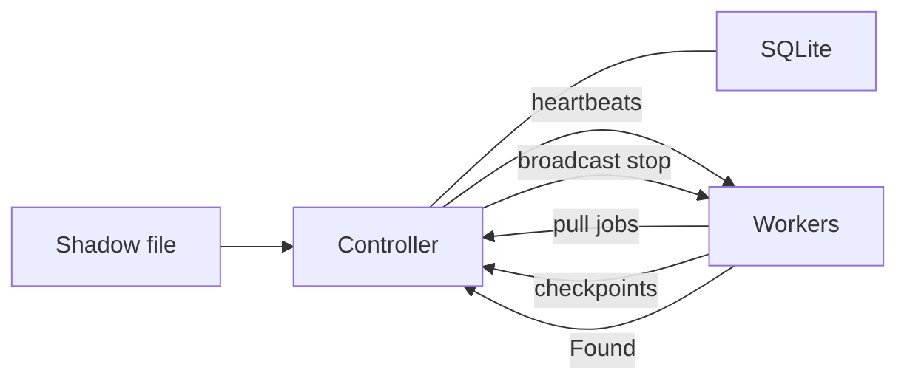
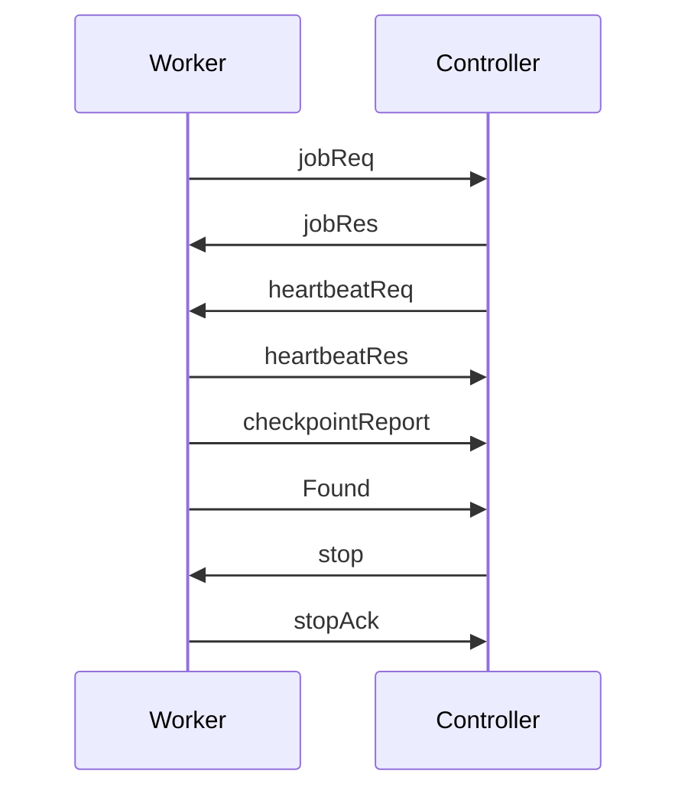
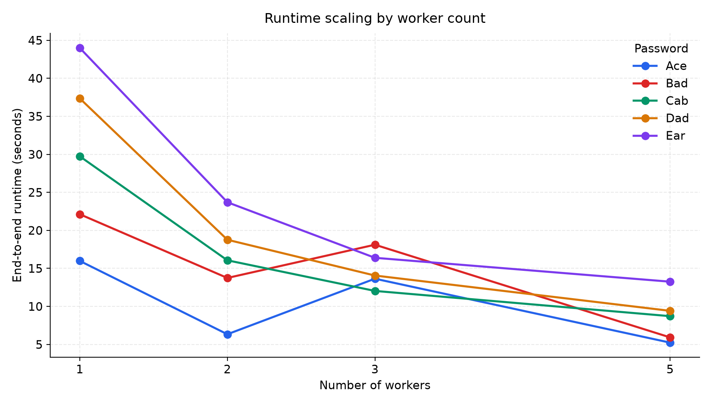
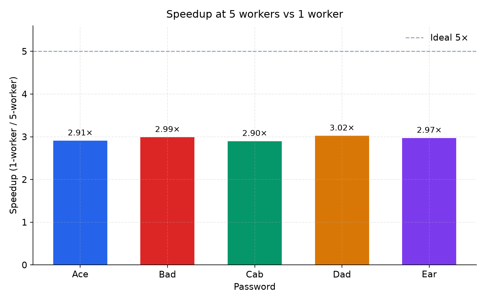
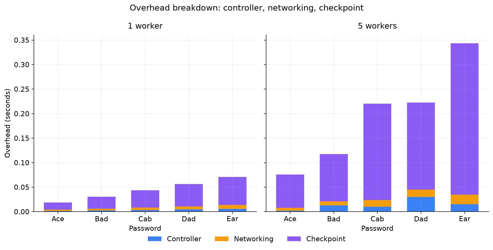
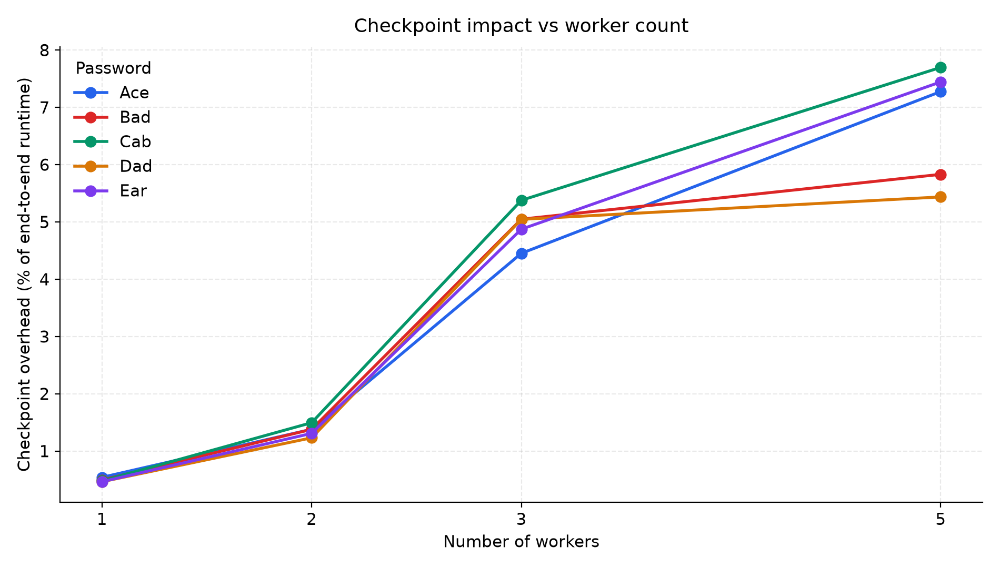
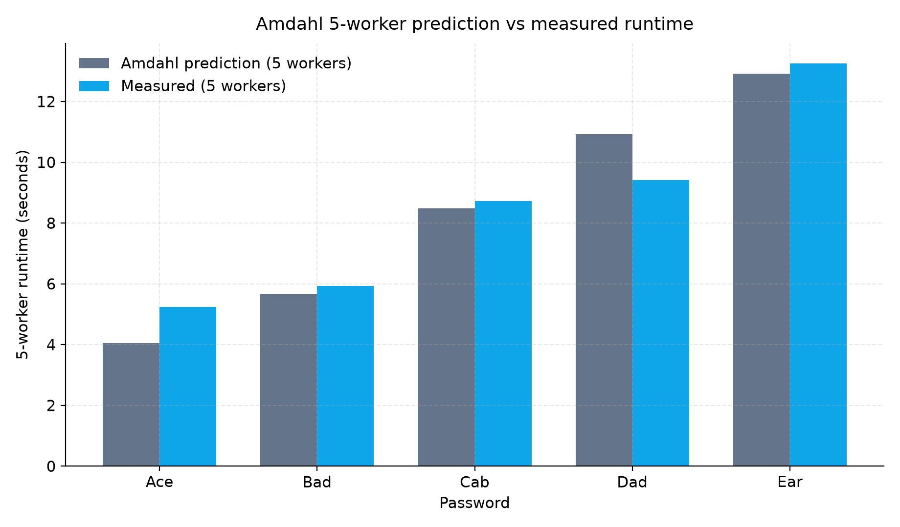

# Distributed Controller/Worker Coordination


A persistent Go controller that coordinates TCP workers over a partitioned search space: pull-based assignment, heartbeat failure detection, checkpoint resume, and SQLite-backed state. The workload is an authorized Unix-hash search used as a measurable compute task — the engineering is coordination, recovery, and measurement, not a single-process brute-force script.

> Authorized security research, coursework, and lab use only.

## What this demonstrates

- **Go** — persistent controller, concurrent workers, goroutines per assigned chunk
- **TCP protocol design** — JSON lines, pull jobs, controller-initiated heartbeats, graceful stop
- **Concurrency** — one connection handles many chunks; each chunk is split across worker threads
- **Fault detection** — missed heartbeats fail the worker and requeue leftover work
- **Checkpoint resume** — progress is persisted so a replacement worker does not restart the chunk
- **SQLite persistence** — WAL mode, single writer; workers, tasks, failures, checkpoints
- **Benchmark analysis** — 1-vs-5 worker scaling, overhead breakdown, Amdahl-style prediction error

## Architecture


```mermaid
flowchart LR
    Shadow["Shadow file"] --> Controller
    Controller --- SQLite
    Workers -->|"pull jobs"| Controller
    Controller -->|"heartbeats"| Workers
    Workers -->|"checkpoints"| Controller
    Workers -->|"Found"| Controller
    Controller -->|"broadcast stop"| Workers
```

Workers verify hashes in-process. There is no shared verifier service and no MySQL. Default crypto is pure Go (bcrypt, sha256/sha512-crypt, md5-crypt); CGO is not required.


```mermaid
sequenceDiagram
    participant Worker
    participant Controller
    Worker->>Controller: jobReq
    Controller->>Worker: jobRes
    Controller->>Worker: heartbeatReq
    Worker->>Controller: heartbeatRes
    Worker->>Controller: checkpointReport
    Worker->>Controller: Found
    Controller->>Worker: stop
    Worker->>Controller: stopAck
```

## How a run works

The controller parses one shadow entry, opens SQLite, and listens on TCP. Each worker connects and pulls work with `jobReq`; the controller replies `jobRes` for the next chunk or a requeued remainder. One connection can run many chunks in a loop. Inside the worker, the assigned range is split across `-t` goroutines and checked locally. The controller sends `heartbeatReq`; after missed replies it marks the worker failed, advances the chunk start from the latest SQLite checkpoint, and requeues the leftover range. When a worker reports `Found`, the controller broadcasts `stop`, workers reply `stopAck`, and connections close. Runtime metrics print once at shutdown.

## Benchmarks

Bcrypt fixture suite from `make graphs` on this tree. Adding workers cuts wall-clock time; the gap to a perfect 5x is coordination (connect, dispatch, checkpoints), which is a larger slice on these short runs.

| Password | 1 worker | 5 workers | Speedup |
| --- | ---: | ---: | ---: |
| Ace | 2.72s | 0.93s | 2.91x |
| Bad | 4.95s | 1.66s | 2.99x |
| Cab | 7.40s | 2.56s | 2.90x |
| Dad | 9.86s | 3.26s | 3.02x |
| Ear | 12.33s | 4.15s | 2.97x |

Speedup ranges from **2.90x to 3.02x** (average **~2.96x**). An Amdahl prediction from the 1–3 worker serial fraction is optimistic here (**+50% to +57%**). Checkpoint time at 5 workers is **5.44%–7.70%** of wall clock. Numbers come from `graphing/output/assignment_summary.csv`.

### Runtime scaling



Wall-clock time falls as workers are added. Longer passwords (Dad, Ear) keep more of the speedup because compute still dominates coordination.

### Speedup



Observed 1-to-5 speedup sits below the ideal 5x line. That gap is the coordination tax, not a compute-scaling failure.

### Overhead breakdown



Most time is hash compute. The remainder is checkpoints, dispatch, and networking — the serial fraction that an Amdahl model cares about.

### Checkpoint impact



Checkpoint share of runtime grows with more workers: the same reporting work is a larger slice of a shorter run.

### Prediction vs measured



A serial-fraction prediction from the 1–3 worker runs underestimates 5-worker time on this machine (**+50% to +57%**). Startup and connect cost do not shrink the way the simple model assumes.

### Regenerating the diagrams

```bash
make graphs
```

That rebuilds the current controller and worker, runs Ace/Bad/Cab/Dad/Ear at 1/2/3/5 workers, writes JSON under `graphing/output/runs/`, then plots. No paste step. Use `make plots` only if you already have those JSON files and want to redraw.

## Quick Start

Needs Go 1.25+. No MySQL, no CGO, no container. Docker is optional.

```bash
cd distributed-multi-workers

go run ./cmd/controller \
  -p 8080 \
  -f testdata/shadow/shadow_ACE_bcrypt \
  -u aryan \
  -b 1 \
  -c 1000 \
  -k 100 \
  -reset
```

In other terminals:

```bash
go run ./cmd/worker -c 127.0.0.1 -p 8080 -t 4
```

`-reset` recreates `cracker.db` in the current directory. Launch several workers to see pull assignment, heartbeats, and scaling.

From the repo root:

```bash
make test
# or: cd distributed-multi-workers && go test ./...
```

Optional Docker environment:

```bash
docker compose up --build -d ubuntu
docker compose exec ubuntu bash
cd /app/distributed-multi-workers
```

## CLI

**Controller**

```bash
go run ./cmd/controller -p PORT -f SHADOW_FILE -u USERNAME -b HEARTBEAT_SECONDS -c PARTITION_SIZE -k CHECKPOINT_INTERVAL [-d SQLITE_DB_PATH] [-reset] [-metrics-json PATH]
```

| Flag | Meaning |
| --- | --- |
| `-p` | listen port |
| `-f` | shadow file |
| `-u` | target username |
| `-b` | heartbeat interval (seconds) |
| `-c` / `-s` | partition size |
| `-k` | checkpoint interval (candidate attempts) |
| `-d` | SQLite path (default `cracker.db`, or `SQLITE_DB_PATH`) |
| `-reset` | drop and recreate tracking tables |
| `-metrics-json` | write structured metrics JSON (optional) |

**Worker**

```bash
go run ./cmd/worker -c HOST -p PORT -t THREADS
```

| Flag | Meaning |
| --- | --- |
| `-c` | controller host |
| `-p` | controller port |
| `-t` | goroutines per assigned chunk |

## Persistence

Local SQLite file, WAL mode, single writer:

- `workers` — state and last heartbeat
- `tasks` — chunk assignment, completion, found password
- `worker_failures` — failure reasons
- `worker_checkpoints` — progress by worker and chunk

That is enough to requeue failed work from the latest checkpoint. A controller crash does not yet reload in-flight state on restart.

## Repository layout

```text
.
├── Makefile
├── docker-compose.yml
├── Dockerfile
├── distributed-multi-workers/
│   ├── cmd/controller
│   ├── cmd/worker
│   ├── testdata/shadow
│   └── internal/
│       ├── chunk
│       ├── protocol
│       ├── transport
│       ├── cracker
│       ├── persistence
│       ├── config
│       ├── utils
│       ├── storage
│       ├── controller
│       └── worker
└── graphing/
    ├── data/
    ├── generate.py
    ├── generate.sh
    ├── run_suite.py
    └── output/
```

## Built / Next

**Built:** TCP pull protocol, in-process pure-Go verifier, SQLite (WAL, single writer), heartbeats and checkpoint resume, find → broadcast stop, unit tests, CI on Go 1.25.6, `make graphs` benchmark pipeline.

**Next:** HTTP `/metrics`, controller crash recovery from SQLite, and a hosted Track B demo (serverless fan-out). Track B is a deliberate trade-off — no live cancel of in-flight workers — and is not in the tree yet.

## Caveats

- Default `go build` / `go test ./...` use the pure-Go verifier. No Linux, CGO, or `libcrypt` required.
- libc `crypt_r` is available behind `-tags cgo_crypt` (Linux + CGO + libcrypt).
- Metrics print to stdout at shutdown. There is no HTTP `/metrics` surface yet.
- Workers do not send `error` messages today; failure is detected by disconnect or missed heartbeats.
- Track B is planned, not implemented.

## Responsible Use

Use this only against systems and hashes you are explicitly authorized to test. It is a systems, distributed-computing, and performance-analysis project for controlled environments.
