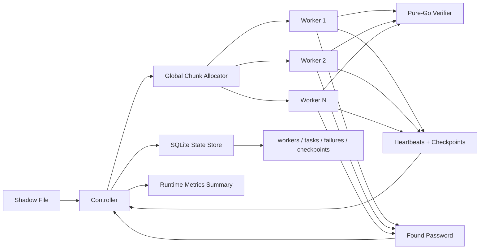
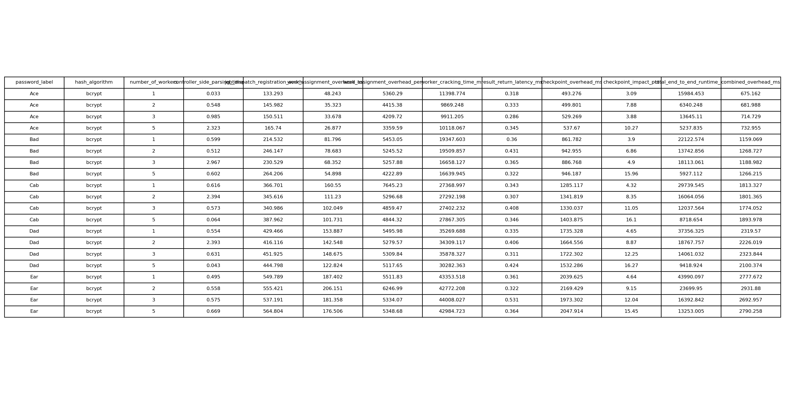
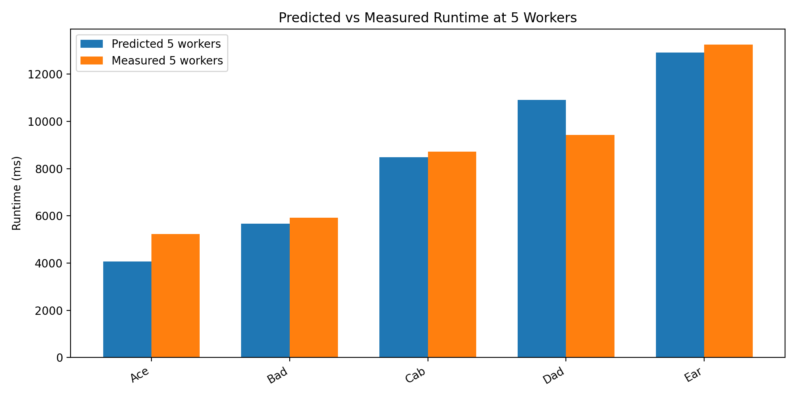
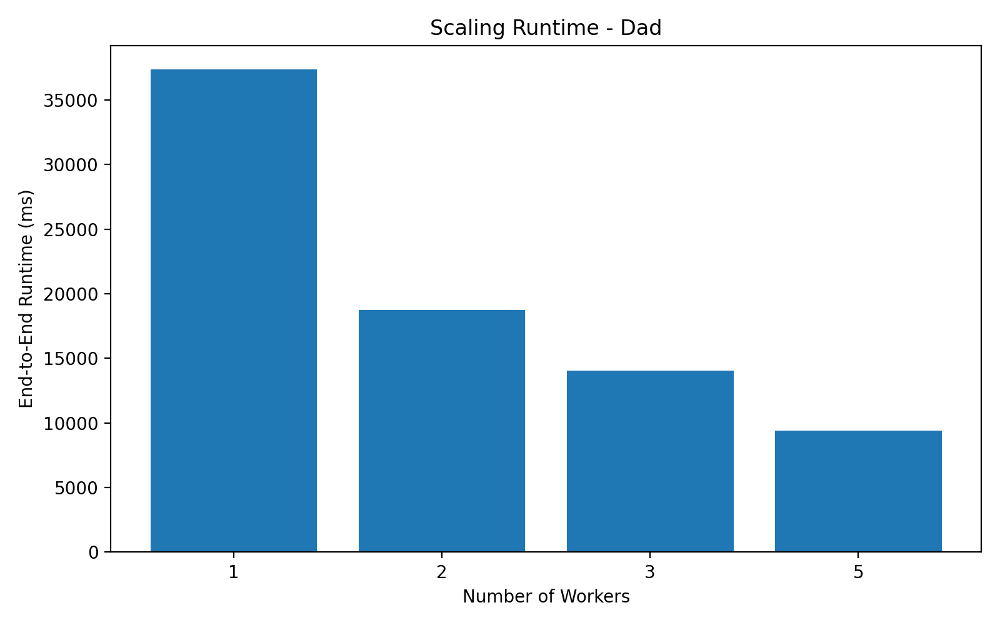
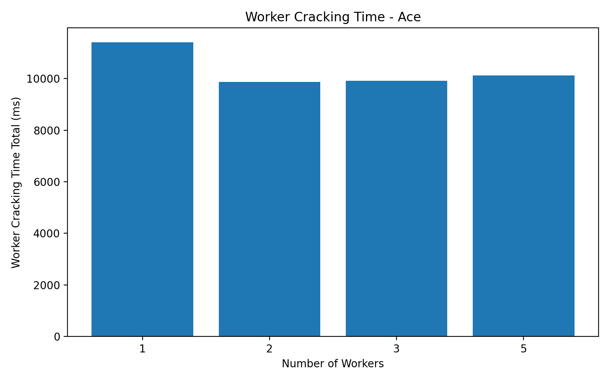
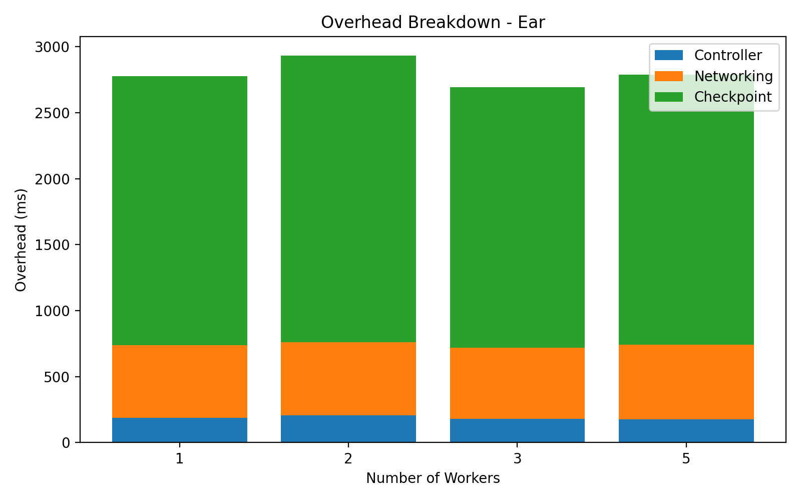
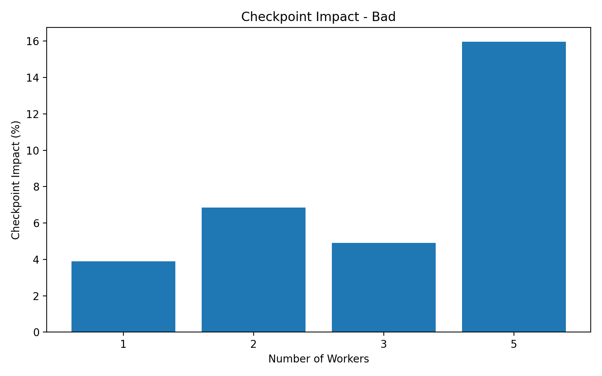
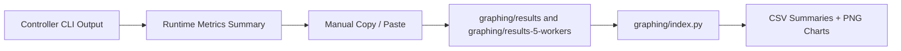

# Unix Password Cracker


Distributed controller/worker system for cracking Unix shadow hashes by partitioning the password space across multiple workers, tracking progress with checkpoints, and persisting worker/task state for failure handling.

This project is best understood as a distributed systems and infrastructure exercise, not just a brute-force tool. The interesting parts are chunk allocation, worker coordination, liveness checks, checkpoint-based recovery, persistence, and performance analysis.

Two separately scoped variants, not one system trying to be both:

- **Track A (this repo today)** — persistent Go controller, TCP workers, SQLite, heartbeats, checkpoints. Run it locally with the Go toolchain (Docker optional).
- **Track B (planned)** — a public "crack your own throwaway password" dashboard. Fully serverless: AWS Step Functions (`Map`) fans out Lambda workers; Next.js is the UI plus a thin API route. No persistent server, near-zero idle cost.

Track B deliberately drops Track A's real-time per-worker push and early-exit cancellation of in-flight workers. That is a trade-off for a zero-maintenance public demo, not a bug.

> Authorized security research, coursework, and lab use only.

## Why This Project Matters

- Treats password cracking as a coordination problem instead of a single-process script.
- Splits the search space across multiple workers and multiple goroutines per worker.
- Detects failures with heartbeats and resumes interrupted work from the latest checkpoint.
- Persists workers, tasks, failures, and checkpoints in a local SQLite file (WAL mode).
- Captures runtime measurements and turns benchmark logs into CSVs and diagrams.
- Default crypto path is pure Go (bcrypt, SHA-256/SHA-512 crypt), so `go build` / `go test ./...` work on a plain clone.

## Architecture


```mermaid
flowchart LR
    S["Shadow File"] --> C["Controller"]
    C --> A["Global Chunk Allocator"]
    A --> W1["Worker 1"]
    A --> W2["Worker 2"]
    A --> WN["Worker N"]

    W1 --> V["Pure-Go Verifier"]
    W2 --> V
    WN --> V

    W1 --> H["Heartbeats + Checkpoints"]
    W2 --> H
    WN --> H
    H --> C

    C --> D["SQLite State Store"]
    D --> T["workers / tasks / failures / checkpoints"]

    W1 --> R["Found Password"]
    W2 --> R
    WN --> R
    R --> C

    C --> M["Runtime Metrics Summary"]
```

## Core Features

- TCP-based controller/worker protocol with explicit job, heartbeat, checkpoint, error, and stop messages
- Global chunk allocation on the controller and per-job sub-allocation inside each worker
- Multi-threaded worker execution over candidate password ranges
- Shadow-file parsing for a specific Unix user entry
- Pure-Go hash verification for bcrypt, md5-crypt, sha256-crypt, and sha512-crypt (default build; no CGO)
- Worker heartbeat monitoring and timeout-triggered chunk requeue
- Checkpoint reporting and checkpoint-based resume on worker failure
- SQLite-backed persistence for worker state, task assignment/completion, failures, and checkpoints
- Runtime metric collection for parsing, dispatch, compute, checkpoint, networking, and total runtime

## Quick Start

Track A only. Needs a Go 1.25+ toolchain — no MySQL, no CGO, no container. The controller writes a local SQLite file and verifies hashes with the default pure-Go backend.

Track B (hosted demo) has no local run path yet.

### 1. Move into the Go module

```bash
cd distributed-muilti-workers
```

Docker is optional if you would rather not install Go locally:

```bash
docker compose up --build -d ubuntu
docker compose exec ubuntu bash
cd /app/distributed-muilti-workers
```

### 2. Start the controller

```bash
go run ./cmd/controller \
  -p 8080 \
  -f testdata/shadow/shadow_ACE_bcrypt \
  -u aryan \
  -b 1 \
  -c 1000 \
  -k 100 \
  -reset
```

Creates (or, with `-reset`, recreates) `cracker.db` in the current directory.

### 3. Start workers in separate shells or tmux panes

```bash
go run ./cmd/worker -c 127.0.0.1 -p 8080 -t 4
```

Launch 3–5 workers to see chunk allocation, heartbeats, and runtime scaling.

Optional CGO `crypt_r` path (Linux + libcrypt): `go run -tags cgo_crypt ./cmd/controller ...`

## CLI Reference

### Controller

```bash
go run ./cmd/controller -p PORT -f SHADOW_FILE -u USERNAME -b HEARTBEAT_SECONDS -c PARTITION_SIZE -k CHECKPOINT_INTERVAL [-d SQLITE_DB_PATH] [-reset]
```

- `-p`: controller port
- `-f`: shadow file path
- `-u`: target username
- `-b`: heartbeat interval in seconds
- `-c` or `-s`: partition size for the password space
- `-k`: checkpoint interval measured in candidate attempts
- `-d`: SQLite file path (default `cracker.db`, or `SQLITE_DB_PATH`)
- `-reset`: drop and recreate tracking tables before startup

There is no `/metrics` listen flag yet; that endpoint is still planned.

### Worker

```bash
go run ./cmd/worker -c HOST -p PORT -t THREADS
```

- `-c`: controller host
- `-p`: controller port
- `-t`: number of worker threads

## Execution Flow

1. The controller parses a target user from a shadow file.
2. Workers connect over TCP and request work.
3. The controller assigns a global chunk from the password space.
4. Each worker splits its assigned chunk into smaller work items across goroutines.
5. Workers send heartbeat and checkpoint reports while searching.
6. If a worker fails or times out, the controller requeues the chunk from the latest checkpoint.
7. When a worker finds the password, the controller persists the result and broadcasts `stop` to all workers.

## Benchmark Snapshot

The repo already contains benchmark summaries and generated plots under `graphing/`.

| Password | 1 Worker | 5 Workers | Speedup |
| --- | ---: | ---: | ---: |
| Ace | 15.98s | 5.24s | 3.05x |
| Bad | 22.12s | 5.93s | 3.73x |
| Cab | 29.74s | 8.72s | 3.41x |
| Dad | 37.36s | 9.42s | 3.97x |
| Ear | 43.99s | 13.25s | 3.32x |

- Observed 1-to-5 worker speedup ranges from `3.05x` to `3.97x`.
- Average 1-to-5 worker speedup across the included bcrypt runs is about `3.50x`.
- Amdahl-style 5-worker runtime prediction error ranges from `-13.73%` to `+29.05%`.
- Checkpoint overhead at 5 workers ranges from `10.27%` to `16.27%` of total runtime in the provided benchmark set.

## Benchmark Diagrams

Only a few representative images are embedded below. The full set lives in `graphing/assignment_output_workers_3/` and `graphing/assignment_output_workers_5/`.

<p align="center">
  
  
</p>

<p align="center">
  
  
</p>

<p align="center">
  
  
</p>

## Benchmarking Workflow

The graphing pipeline is not wired directly into the controller or workers. The runtime metrics are printed to the CLI, then copied into the `graphing/` inputs and processed offline.


```mermaid
flowchart LR
    C["Controller CLI Output"]
    M["Runtime Metrics Summary"]
    X["Manual Copy / Paste"]
    R["graphing/results and graphing/results-5-workers"]
    P["graphing/index.py"]
    O["CSV Summaries + PNG Charts"]

    C --> M
    M --> X
    X --> R
    R --> P
    P --> O
```

## Generating the Graphs

The plotting dependencies live in `graphing/requirements.txt`.

```bash
cd graphing
python3 -m venv .venv
source .venv/bin/activate
pip install -r requirements.txt
python index.py
```

Current workflow:

1. Run benchmark scenarios and capture the printed runtime summaries from the CLI.
2. Manually copy those results into `graphing/results` or `graphing/results-5-workers`.
3. Run `graphing/index.py`.
4. Review the generated CSV and PNG outputs.

The current script writes outputs into `assignment_output_workers_5/`. The repo also includes pre-generated `assignment_output_workers_3/` artifacts.

## Persistence Model

Today, the persistence layer is a local SQLite file (WAL mode, single writer) and records:

- `workers`: worker state and last heartbeat updates
- `tasks`: chunk assignments, completion state, and found password
- `worker_failures`: worker failure reasons
- `worker_checkpoints`: checkpoint progress by worker and chunk

That gives the controller enough state to requeue failed work from the latest checkpoint. It does not yet restore full controller state automatically after a controller restart.

## Repository Layout

```text
.
├── distributed-muilti-workers/
│   ├── cmd/controller
│   ├── cmd/worker
│   ├── internal/controller
│   ├── internal/worker
│   ├── internal/storage
│   └── testdata/shadow
├── graphing/
│   ├── results
│   ├── results-5-workers
│   ├── assignment_output_workers_3
│   ├── assignment_output_workers_5
│   └── index.py
├── docker-compose.yml
└── Dockerfile
```

## Roadmap

PLAN.md is the source of truth. Done items below match the current tree; unchecked items are still planned.

### Shared foundation

- [x] Pure-Go default crypto backend (bcrypt, md5-crypt, sha256-crypt, sha512-crypt)
- [x] CGO `crypt_r` demoted to opt-in `-tags cgo_crypt` (not the default clone or CI path)
- [ ] Pure-Go **hash** (generate), not just verify — needed to turn a Track B typed password into a target hash

### Track A — Local controller/worker

No architecture change. Persistent Go controller distributing work over TCP, as documented above.

**Done**

- [x] Distributed controller/worker execution over TCP
- [x] Shadow parsing and hash-target loading
- [x] Chunk partitioning and multi-threaded worker search
- [x] Heartbeat monitoring and worker timeout handling
- [x] Checkpoint reporting and checkpoint-based chunk resume
- [x] SQLite persistence (`modernc.org/sqlite`, WAL, single writer) for workers, tasks, failures, and checkpoints
- [x] Benchmark summaries, CSV exports, and plotted diagrams

**Planned**

- [ ] Fix `NewWorkerManger` → `NewWorkerManager`
- [ ] Rename `distributed-muilti-workers/` → `distributed-multi-workers/`
- [ ] Comment that `maxIndex=0` on the global allocator is intentional (full `uint64` keyspace)
- [ ] Unit tests for chunk allocation, cracker engine, protocol messages, and shadow parsing
- [ ] CI: bump Go to `1.25.6` to match `go.mod`; run the default pure-Go build/tests only
- [ ] `/metrics` HTTP endpoint: `jobs_queued`, `jobs_running`, `jobs_completed`, per-worker rate, aggregate hashes/sec, active workers
- [ ] Controller crash recovery: reload in-progress tasks/workers from SQLite on startup unless `--reset`

### Track B — Hosted serverless demo

Public "crack your own throwaway password" dashboard. Next.js calls `StartSyncExecution` on a Step Functions Express Workflow; Lambdas use the shared pure-Go backend (`GOOS=linux GOARCH=arm64` zip deploy, no Docker/ECR).

**Trade-offs vs Track A (by design)**

- No real-time per-worker push. The UI plays an optimistic "N workers racing" animation, then reveals real per-chunk results when the synchronous execution returns.
- No early-exit cancellation. A Step Functions `Map` state cannot cancel sibling iterations, so every chunk runs to completion even after one finds the password. Track A broadcasts `stop` on a find. Acceptable here because the demo keyspace is capped.

**Planned**

- [ ] `prepare-worker` and `crack-worker` Lambda handlers, tested as plain Go functions first
- [ ] Shared demo cap policy (length/charset limits + estimated-time math)
- [ ] Step Functions Express Workflow: Prepare → CrackFanOut (`Map`, capped concurrency) → Aggregate
- [ ] Next.js playground (`frontend/`): throwaway-password disclaimer, server-side caps, per-IP rate limit, global concurrency ceiling; plaintext never logged or persisted
- [ ] Terraform (`infra/terraform/`): IAM, zip Lambdas, Express state machine; `apply` is a manual, reviewed step

## Caveats

- Default `go build` / `go test ./...` use the pure-Go verifier. No Linux, CGO, or `libcrypt` required.
- libc `crypt_r` is still available behind `-tags cgo_crypt` (Linux + CGO + libcrypt).
- Metrics print to stdout at the end of a run; there is no HTTP `/metrics` surface yet.
- Some unit tests exist; chunk, engine, protocol, and shadow tests are still planned.
- Track B (hosted demo) is not in the tree yet.

## Validation

From the Go module directory:

```bash
cd distributed-muilti-workers
go test ./...
```

Default (pure-Go) tests run here. The CGO path is a manual local check (`-tags cgo_crypt`), not the default CI job.

## Responsible Use

This project should only be used against systems and hashes you are explicitly authorized to test. It is intended for systems programming, distributed computing, and performance-analysis work in controlled environments.
